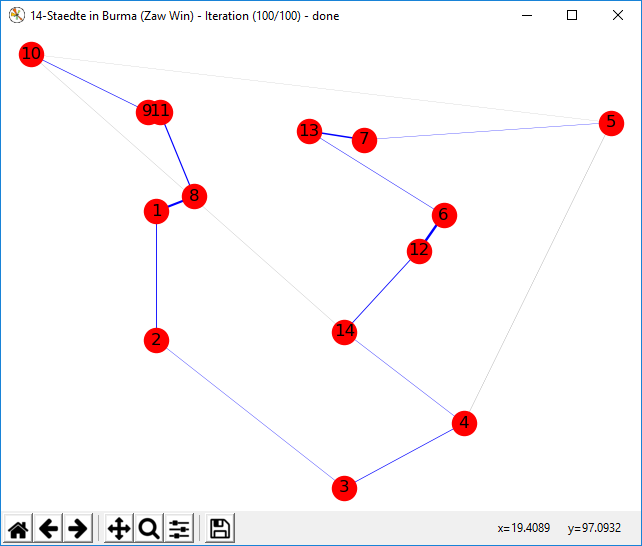

# Ant Colony Optimization

## Description

This repository implements an ant colony optimization algorithm for the traveling salesman problem (TSP) like Marco Dorigo, Mauro Birattari, and Thomas Stützle introduced in the [IEEE Computational Intelligence Magazine](https://ieeexplore.ieee.org/document/4129846) in November 2006 (DOI: 10.1109/MCI.2006.329691).  
The implementation was part of the course [Natural computing for learning and optimisation](https://is.cuni.cz/studium/eng/predmety/index.php?do=predmet&kod=NPFL107) at Charles University Prague in winter 2018/2019.

## Usage
1. Check out the repository:
  ```
  git clone git@github.com:HaaLeo/ant-colony-optimization.git
  ```
2. Run py -3 src/main.py

To change the parameters, currently you need to edit the `main.py` file.

## Features


Enables to apply the ant colony optimization algorithm to the TSP using a [TSPLIB95](https://www.iwr.uni-heidelberg.de/groups/comopt/software/TSPLIB95/index.html) file and plots its result.



The algorithm solves the TSP and plots the result all _n_ iterations.  
The nodes are plot according to their coordinates read from the TSPLIB95 file. The widths of the edges indicate the amount of pheromone that is associated with this edge. If an edge is blue, it is part of the current best found path.

## License
See [LICENSE.txt](LICENSE.txt).
